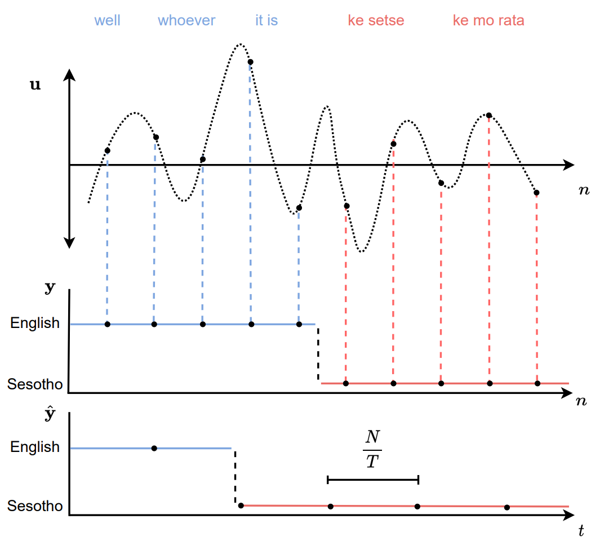

# Fine-Tuned Self-Supervised Speech Representations for Language Diarization in Multilingual Code-Switched Speech
Offical repository for work presented at [SACAIR 2022](https://2022.sacair.org.za/). Arxiv link to come!

## Abstract
> Annotating a multilingual code-switched corpus is a painstaking process requiring specialist linguistic expertise. This is partly due to the large number of language combinations that may appear within and across utterances, which might require several annotators with different linguistic expertise to consider an utterance sequentially. This is time-consuming and costly. It would be useful if the spoken languages in an utterance and the boundaries thereof were known before annotation commences, to allow segments to be assigned to the relevant language experts in parallel. To address this, we investigate the development of a continuous multilingual language diarizer using fine-tuned speech representations extracted from a large pre-trained self-supervised architecture (WavLM). We experiment with a code-switched corpus consisting of five South African languages (isiZulu, isiXhosa, Setswana, Sesotho and English) and show substantial diarization error rate improvements for language families, language groups, and individual languages over baseline systems.

## Quick Start
Pretrained model checkpoints (for wavlm-large) are made available through torch hub for each LD task presented in the paper. Inference is super easy:

```python
import torch
import torchaudio
import torch.nn.functional as F

if torch.cuda.is_available(): device = 'cuda'
else: device = 'cpu'

repo = 'GeoffreyFrost/code-switched-language-diarization'
# There are three diarization options: 0 (eng/other), 1 (eng/nguni/sesotho-tswana), 2 (eng/zulu/xhosa/sesotho/setswana)
diarization_config = 0

model = torch.hub.load(repo, 'wavlm_for_ld', diarization_config=diarization_config, device=device)

device = torch.device(device)
audio, sr = torchaudio.load('path/to/your/16kHz/utterence') # NB: WavLM only supports 16kHz audio
audio = audio.to(device)
l = torch.tensor([audio.size(-1)]).to(device) # Length of original wavform (important if it has been padded for batching)
logits, lengths = model.forward(audio, l) # Returns langauge logits in 20ms segments and length of the unpadded sequence (proportional to original waveform length)
y_hat = F.softmax(logits, dim=-1) # Langauge probabilities
predicted_labels = y_hat.argmax(dim=-1) # Langauge labels
```
**Importantly**, wavlm extracts context representations that *correspond* to a 20ms segment of audio with no overlap. If you would like labels for each discrete sample in the original waveform, you would need to upsample these predictions to the desired length.

## TL;DR

We fine-tune wavlm for continuous language identification, also referred to as language diarization (LD), and benchmark its performance against baseline architectures from the litrature. LD is described in the figure below, for a target discrete utterance waveform $\mathbf{u}=(u_n \in\mathbb{R}|1,...,N)$ with ground truth language labels $\mathbf{y}=(y_n \in[C]|1,...,N)$ where $C$ is the set of languages, and predicted segmented language labels $\hat{\mathbf{y}}=(\hat{y}_t \in[C]|1,...,T)$ where the segment length is $\frac{N}{T}$.

<div align="center">

</div>

 We experiment with three diffrent LD tasks using the [South African soap opera corpus](https://repo.sadilar.org/handle/20.500.12185/545?show=full) :

- **English/Bantu (task 0)**: All four Bantu languages are grouped and the network determines whether the language spoken in a segment is English or belongs to the Bantu family.
- **English/Nguni/Sotho-Tswana (task 1)**: The Bantu languages are grouped according to their respective language groups and the network determines whether the language spoken in a segment is English, a Nguni language or a Sotho-Tswana language.
- **English/isiZulu/isiXhosa/Sesotho/Setswana (task 2)**: The network determines whether the language spoken in a segment is English, isiZulu, isiXhosa, Sesotho or Setswana.

WavLM models consistantly outperform baseline systems:
**TODO**: add table

## Running experiments

Download the balanced bilingual code-switched corpora [soapies_balanced_corpora.tar.gz](https://drive.google.com/file/d/1r59AaXOtZZYZlTEjREyQlNP1t4Xw-LIj/view?usp=share_link) and unzip it to a directory of your choice.

```bash
tar -xf  soapies_balanced_corpora.tar.gz -C /path/to/corpora
```

Set up your environment. This step is optional (the main dependencies are `PyTorch` and `Pytorch Lightning`), but you'll hit snags along the way, which may be a bother.

```bash
conda env create --name myenv -f enviornment.yml
conda activate myenv
```

### Training

All configs as presented in the paper can be found in `final_runs.txt`, which can be run sequentially with

```bash
python runs.py --cmds-path final_runs.txt
```

Progress can be insepected with tensorboard, which includes per epoch development set performance. More in-depth development analysis and metrics are facilitated by the `devlopment_tinker.ipynb` notebook (found under the `notebooks/` directory).

Altenertivly, `main.py` can be used to run any supported experiment configuration using a host of arguments.

#### Arguments

A host of configuration arguments are offered in `main.py`, most of which are self-explanatory (see the script). Some of them are not relevant to the final paper but were used to explore fun ideas (soft units, data augmentation, and a few other random things). Some important ones:

- `--baseline`: Which baseline model to use ["blstm", "xsa"].
- `--backbone`: Which ssl transformer to use ["base","large", "xlsr", "wavlm-large",  "wavlm-base"]. "base","large" and "xlsr" all refer to the respective wav2vec2 models, although experiments with these were not presented.
- `--no-mono-eng`: Do not use any monolingual English utterances during training.
- `--pretrained-eng-other`: Initialise weights to a model trained on the English/Bantu diarization task.
- `--pretrained-lang-fams`: Initialise weights to a model trained on the language family dirazation task.
- `--pretrained-weights-path`: Path for a respective pre-trained model. **Important**, this is only necessary if the `--final` flag is *NOT* used.
- `--final`: Creates the file structure to run experiments smoothly (such as automatic path assignment for loading of pre-trained weights) and for `test.py` functionality.

### Final evaluation (testing)

It is time to test our developed models! For this to work, the following file structure is required (although modifications can be made to `test.py` to take absolute file paths)
```
final
|---blstm
|    ...
|---wavlm-large
    |---lightning_logs
        |---version_0           # English/other
        |   |---checkpoints
        |   |   |---*.ckpt
        |   |   ....
        |---version_1           # Language families
        |   |... 
        |---version_2           # All languages
            |... 
```
Run `test.py` with for a specific model and diarization config (0=English/other, 1=language families and 2=all languages)

```bash
python test.py --model wavlm-large --diarization-config 0 --save-cm 
```

Which should output the following and save the confusion matrix
```bash     
Global Error Rate: 0.1005
Mean Error Rate: 0.1194
```

## Acknowledgements
Parts of code for this project are adapted from the following repositories:
- [https://github.com/microsoft/unilm/tree/master/wavlm](https://github.com/microsoft/unilm/tree/master/wavlm)
- [https://github.com/Lhx94As/E2E-language-diarization](https://github.com/Lhx94As/E2E-language-diarization)

## Citation
> Frost, G., Morris, E., Jansen van Vüren, J., Niesler, T. (2022). Fine-Tuned Self-supervised Speech Representations for Language Diarization in Multilingual Code-Switched Speech. In: Pillay, A., Jembere, E., Gerber, A. (eds) Artificial Intelligence Research. SACAIR 2022. Communications in Computer and Information Science, vol 1734. Springer, Cham. https://doi.org/10.1007/978-3-031-22321-1_17
